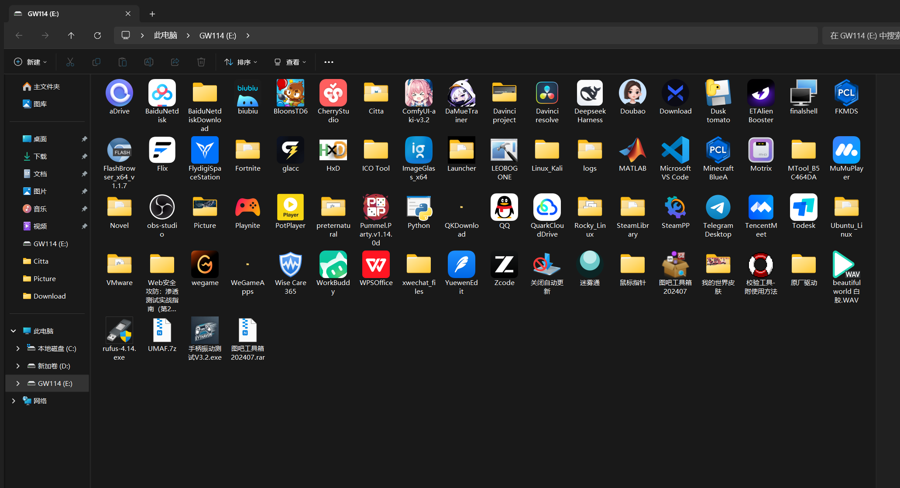
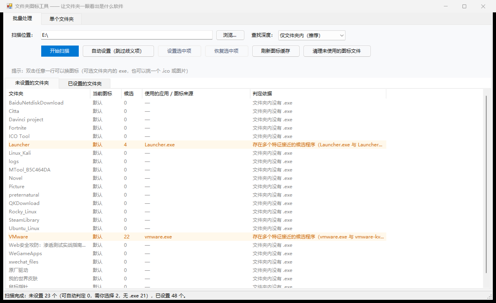

<div align="center">

# 文件夹图标工具 · FolderIcon

**把 `HxD`、`obs-studio`、`ComfyUI-aki-v3.2` 这种看不出内容的英文文件夹，变成一眼就能认出来的样子。**

读取文件夹里应用程序的图标，自动设置成文件夹本身的图标。

[](https://www.microsoft.com/windows)
[](https://learn.microsoft.com/powershell/)
[](https://dotnet.microsoft.com/)
[](LICENSE)
[](#快速开始)



**中文** · [English](#english)

</div>

---

## 解决什么问题

下载的绿色软件、游戏、工具集解压出来都是英文文件夹名，在资源管理器里长得一模一样：

```
E:\
├── HxD                    ← 十六进制编辑器？
├── obs-studio             ← 录屏软件
├── ComfyUI-aki-v3.2       ← AI 绘图，里面是「绘世启动器」
├── DaMueTrainer           ← ？？
└── Flix                   ← ？？
```

这个工具把这些文件夹的图标替换成对应程序的图标，扫一眼就知道里面是什么。

---

## 快速开始

**不需要安装任何东西**，双击 `启动.cmd` 即可。

> 要求：Windows 10 / 11，且目标磁盘是 **NTFS** 格式。

### 一、批量处理整个磁盘

1. 「扫描位置」填 `E:\`，点 **开始扫描**
2. 列表分两页，**已设置好图标的文件夹会自动归档**：

   | 页 | 内容 |
   |---|---|
   | **未设置的文件夹** | 待处理。黑字可自动判定，橙底需你选择，灰字是没有 exe 的数据文件夹 |
   | **已设置的文件夹** | 已设好的，自动归到这里，想改再双击 |

3. 点 **自动设置（跳过歧义项）** —— 所有能确定的文件夹一次性设置完并自动归档
4. 橙底的行 **双击** 打开选择窗口处理

### 二、处理单个文件夹

「单个文件夹」选项卡 → 选文件夹 → **分析** → 三种方式任选：

- 把选中的 exe 设为图标
- 自动判定并设置
- **用图标文件设置**（自己挑 `.ico` / 图片）

### 双击后的选择窗口

三种方式任选，选中后右侧**立即显示七种尺寸的预览**，满意再确认：

| 方式 | 说明 |
|---|---|
| ① 从列表挑程序 | 文件夹内所有 exe，带图标、大小、类型、匹配度和推荐标记 |
| ② 从文件选择图标 | 任意位置的 `.ico` / `.exe` / `.dll` / `.png` / `.jpg` / `.bmp` / `.gif` |
| ③ 打开所在文件夹 | 用资源管理器打开，自己去找 |

<div align="center">

</div>

---

## 功能特性

- **智能识别应用本体** —— 不是简单取第一个 `.exe`，见下方[判定逻辑](#如何判断哪个-exe-才是应用本体)
- **排除干扰项** —— 卸载器、安装器、更新器、欢迎页、教程、托盘程序、崩溃报告一律不选
- **自动深入子目录** —— 文件夹内只有卸载程序时，会去 `bin\`、`app\` 等子目录找真正的本体
- **拿不准就问你** —— 只有最优候选明显领先才自动设置，否则交给你判断
- **多来源图标** —— exe 内嵌图标、`.ico` 文件、普通图片都能用
- **多尺寸重建** —— 生成 16/24/32/48/64/128/256 七种尺寸，小图标视图下依然清晰
- **一键恢复** —— 完整撤销，文件夹回到原样
- **不污染文件夹** —— 生成的 `.ico` 存在 `%LOCALAPPDATA%`，不会往你的文件夹里塞文件
- **自动归档** —— 设置好的文件夹自动移到「已设置」页
- **命令行模式** —— 可脚本化批量处理

---

## 如何判断"哪个 exe 才是应用本体"

综合打分，而不是猜：

| 判断依据 | 说明 |
|---|---|
| **名称吻合度** | `HxD.exe` 放在 `HxD\` 里 = 最强信号 |
| **程序类型** | 解析 PE 头判断图形界面 / 控制台，图形程序优先 |
| **明确排除** | `unins000.exe`、`setup.exe`、`update.exe` 等**绝不**当作本体 |
| **干扰项降权** | 欢迎页（welcome）、教程、扫描器、托盘、崩溃报告、运行库等一律降权 |
| **文件体积** | 应用本体通常明显更大 |
| **自动深入子目录** | 顶层只有卸载器时，自动搜索一层子目录 |
| **所在层级** | 同层优先，子目录扣分 |

**只有当最优候选与第二名差距足够大时才自动设置**，否则一律交给用户判断 —— 宁可多问一次，也不乱设一个错图标。

---

## 实现原理

设置文件夹图标靠 Windows 的 `desktop.ini` 机制，本工具做三件事：

### 1. 取得图标

| 来源 | 做法 |
|---|---|
| `.exe` / `.dll` | `SHDefExtractIcon` 按每种尺寸分别提取原图 |
| `.ico` | 直接解析文件内已有尺寸 |
| 图片 | 按最长边等比缩放到正方形（保持透明），再生成各尺寸 |

缺失的尺寸由更大的尺寸**高质量缩小**补齐（**绝不放大**），最终重建成一个多尺寸 `.ico`：
32 位 BGRA + 正确的 AND 掩码，alpha 透明完整保留。

### 2. 写 `desktop.ini`

以 UTF-16LE 写入 `IconResource=<绝对路径>,0`，并把文件设为 **隐藏 + 系统** 属性。

### 3. 给文件夹加 `只读` 属性 ⚠️

**这一步是关键，也是本项目踩过最大的坑：**

> 资源管理器**只有在文件夹本身带 `READONLY` 或 `SYSTEM` 属性时**，
> 才会去读取该文件夹下的 `desktop.ini`。少了这一步，图标**完全不会生效**，
> 而且没有任何报错 —— 你会以为是 `desktop.ini` 写错了。

另外还有一个坑：若 `desktop.ini` 已存在且带隐藏/系统属性，
用 `FileMode.Create` 打开写入会被系统拒绝（`UnauthorizedAccessException: Access to the path ... is denied`），
必须先清掉属性再写。

---

## 命令行模式

```powershell
# 批量处理（自动判定，歧义项只列出不处理）
.\FolderIconTool.ps1 -ScanRoot 'E:\' -NoGui

# 处理单个文件夹（来源可以是 exe、ico 或图片）
.\FolderIconTool.ps1 -Folder 'E:\HxD' -Exe 'E:\HxD\HxD.exe' -NoGui
.\FolderIconTool.ps1 -Folder 'E:\HxD' -Exe 'D:\my-icon.ico' -NoGui

# 恢复单个文件夹
.\FolderIconTool.ps1 -Folder 'E:\HxD' -Revert -NoGui
```

---

## 常见问题

<details>
<summary><b>图标设置完没变化？</b></summary>

正常情况下几秒内就会变。如果没变：

1. 按 **F5** 刷新那个资源管理器窗口
2. 还不行就点界面里的 **刷新图标显示**，或 **重建图标缓存**

「重建图标缓存」会删除 `iconcache*.db`，资源管理器几秒内自动重建，**不需要管理员权限**。
</details>

<details>
<summary><b>提示"拒绝访问"？</b></summary>

少数文件夹的 ACL 较严（部分安装程序会锁自己的目录），以管理员身份重新运行一次即可。
</details>

<details>
<summary><b>能撤销吗？</b></summary>

可以，完全可逆：

- 单个文件夹：「单个文件夹」选项卡 → **恢复默认图标**
- 批量：选中若干行 → **恢复选中项**（会自动移回「未设置」页）

恢复时会删掉 `desktop.ini` 并撤掉文件夹上的"只读"标记，文件夹回到普通模样。
</details>

<details>
<summary><b>支持 exFAT / FAT32 / 网络驱动器吗？</b></summary>

不支持。`desktop.ini` 是 NTFS 的特性，在 exFAT、FAT32、网络驱动器上不生效。
</details>

<details>
<summary><b>文件夹搬到别的电脑后图标丢了？</b></summary>

生成的 `.ico` 存在本机 `%LOCALAPPDATA%\FolderIconTool\icons\`，且 `desktop.ini` 里是绝对路径。
跨机器移动文件夹后重新设置一次即可。
</details>

<details>
<summary><b>自动识别会认错吗？</b></summary>

会。启发式规则不可能 100% 准确，所以工具把拿不准的情况**留给你判断**而不是硬猜。
认错了随时可以恢复或重设。
</details>

---

## 项目结构

| 文件 | 作用 |
|---|---|
| `启动.cmd` | 双击启动（无控制台窗口） |
| `FolderIconTool.ps1` | 主程序（WinForms 图形界面 + 命令行模式） |
| `FolderIcon.Core.cs` | 核心引擎（PE 解析、图标提取、ICO 生成、desktop.ini 管理） |
| `Print-Window.ps1` | 开发用截图工具（`PrintWindow` 抓取被遮挡窗口，用于核对效果） |
| `使用说明.md` | 面向使用者的详细文档 |
| `doc/` | 截图 |

技术栈：**PowerShell 5.1 + WinForms + C#（通过 `Add-Type` 内嵌编译）**。
选择这个组合是为了**零安装**：不装 .NET SDK、不需编译步骤，双击就能跑。

---

## 开发

```powershell
# 语法检查
$e=$null;$t=$null
[System.Management.Automation.Language.Parser]::ParseFile(
    "$PWD\FolderIconTool.ps1", [ref]$t, [ref]$e); $e

# 编译核心引擎（单独验证）
Add-Type -AssemblyName System.Drawing, System.Windows.Forms
Add-Type -Path .\FolderIcon.Core.cs -ReferencedAssemblies System.Drawing, System.Windows.Forms

# 界面自检：构建界面 → 自动扫描 → 分析 → 测试 ico/png 来源 → 打开选择窗口 → 关闭
.\FolderIconTool.ps1 -SelfTest

# 打开界面并自动扫描（用于截图核对）
.\FolderIconTool.ps1 -AutoScan 'E:\' -AutoCloseSeconds 30
```

> ⚠️ **改代码时注意**：`.ps1` 文件**必须带 UTF-8 BOM**。
> Windows PowerShell 5.1 读取无 BOM 的 UTF-8 文件时会按 ANSI 解析，中文全部乱码并导致语法错误。

---

## 已知限制

- 仅 **NTFS** 有效
- 图标的 `IconResource` 路径是绝对的，跨机器失效
- 少数文件夹需要管理员权限
- 自动识别是启发式的，不保证 100% 准确（拿不准时会询问用户）

---

## License

[MIT](LICENSE)

---

<a id="english"></a>

## English

**FolderIcon** — Give a folder the icon of the application inside it, so you can tell at a glance
what `HxD`, `obs-studio` or `ComfyUI-aki-v3.2` actually contains.

A zero-install Windows tool (PowerShell 5.1 + WinForms, C# engine compiled on the fly via `Add-Type`).
Just double-click `启动.cmd`.

**Highlights**

- **Smart executable picking** — not just the first `.exe`: scores name match, PE subsystem
  (GUI vs console), file size and directory depth; hard-excludes uninstallers, installers,
  updaters, welcome screens and helper binaries. Recurses one level into `bin\`/`app\` when the
  top level only has an uninstaller. Asks the user whenever it isn't confident.
- **Any icon source** — embedded icons in `.exe`/`.dll`, `.ico` files, or plain images
  (`.png`/`.jpg`/`.bmp`/`.gif`).
- **True multi-size icons** — rebuilds 16/24/32/48/64/128/256 px frames as 32-bpp BGRA with a
  correct AND mask and preserved alpha. Never upscales.
- **Reversible** — one click restores the folder, removing `desktop.ini` and the `READONLY` flag.
- **Non-invasive** — generated `.ico` files live in `%LOCALAPPDATA%\FolderIconTool\icons\`,
  never inside your folders.

**Two gotchas this project had to solve** (both fail silently, no error at all):

1. Explorer only reads a folder's `desktop.ini` **if the folder itself carries the `READONLY`
   or `SYSTEM` attribute**.
2. Writing to an existing `desktop.ini` that has hidden/system attributes is **refused** with
   `UnauthorizedAccessException` when opened with `FileMode.Create` — attributes must be cleared first.

**Requirements**: Windows 10/11, target volume must be **NTFS** (`desktop.ini` does not work on
exFAT/FAT32/network drives).

See [使用说明.md](使用说明.md) for the full Chinese manual.

